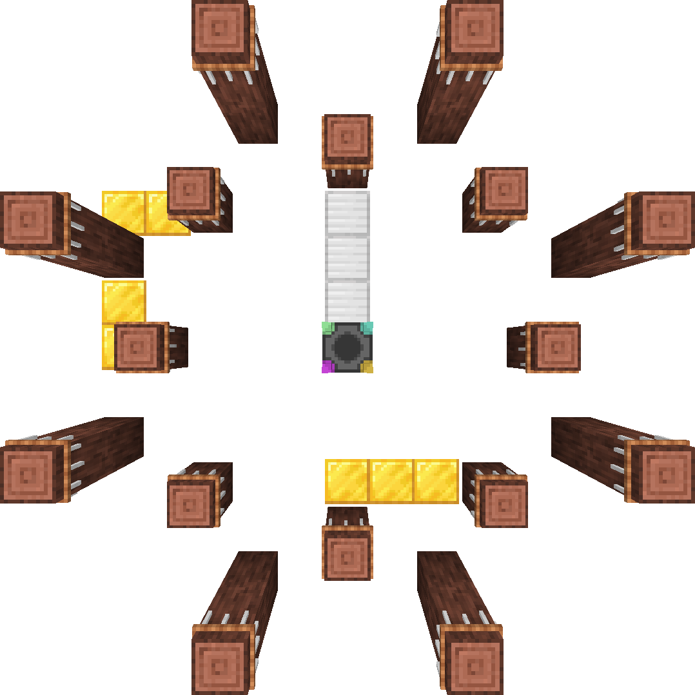

# 仪式合成

## 它如何工作

仪式制作是一种在多方块结构中合成物品的方式。它比普通的合成要复杂一些，但它允许更复杂的配方。

仪式制作是通过设置一个祭坛来完成的，神社祭坛周围环绕着尽可能多的御柱。御柱必须以特定方式摆放，而神社祭坛必须放置在图形的中心。

<figure markdown>
  {width="600"}
  <figcaption>御柱彼此之间的距离及御柱与神社祭坛之间的距离.</figcaption>
</figure>

外圈必须比内圆高一个方块。外圈的底座并不重要。

将材料放在御柱上，对神社祭坛按下使用键即可启动合成。

## 御柱

每个御柱可以容纳一件物品。如果御柱上面的方块不是空气，则无法将物品放置在御柱上。

御柱可以通过摆放 **御柱支架** 并对着其使用 [拴绳](https://minecraft.fandom.com/wiki/Lead) 和 拿在手里的[纸](https://minecraft.fandom.com/wiki/Paper) 创建。