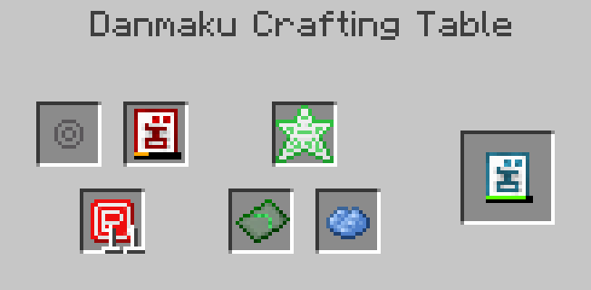

# 弹幕

## 介绍

弹幕游戏（STG）, 又被称为子弹地狱, 是射击游戏的一个子类型，通常有数十到数百个敌弹同屏。东方project是此类游戏中较为著名的例子。

在幻想之梦模组中，弹幕是一个允许您创建子弹图案并在战斗中使用它们的系统。当然，也有敌人使用弹幕来对付你。从某种意义上说，弹幕相当于这个模组的魔法。

## 新手上路

要创造您自己的弹幕, 你需要一些材料. 这些材料的主要来源是模组中的各种敌人。

!!! 提示

    材料的作用可通过标签进行修改

图标  |   材料   | 描述
-----|----------|------------
 | P点 | 用于提升弹幕的杀伤力
 | 大型P点 | 用于增加弹幕数量，也用于合成初始弹幕
 | 蓝点 | 用于提升弹速
 | 大型蓝点 | 暂无用途
 | 星点 | 用于增加子弹的持续时间及合成子弹核心
 | 信仰点 | 用于修复破损的弹幕
 | 刻符 | 将弹幕冷却时间永久减半

第一步是合成一个子弹核心。每种子弹类型都有一个等效的子弹核心。这些可以在工作台中使用星点制作。

!!! 注意

    每种子弹类型都有自己的基础和最大属性。

图标 | 子弹类型 | 注释
-----|-------------|-----------
 | 小玉 |
 | 大玉 | 碰撞箱较大
 | 札弹 | 对亡灵生物造成更高的伤害
 | 星弹 | 无视护甲
 | 苦无 | 刺穿敌人
 | 点弹 | 密度极高

要将子弹核心变成可用的子弹，您需要一个弹幕工作台

## 弹幕工作台

弹幕工作台是用于创造，修改及修复弹幕的方块.

1. 子弹核心
2. 子弹
3. 改性材料
4. 修复材料
5. 模板
6. 染料
7. 输出

在子弹核心槽中放置一个子弹核心，在修改器槽中放置一个大P点，将产生一个子弹。从那里，你可以将它放在子弹槽中，使用修复槽中的信仰点进行修复，或者使用其他原料和槽位进行修改。

<figure markdown>
  {width="326"}
  <figcaption>示例：制作一个小玉</figcaption>
</figure>

<figure markdown>
  {width="326"}
  <figcaption>示例：修复和修改弹幕颜色.</figcaption>
</figure>

## 使用弹幕

拿到子弹后，您可以像使用任何其他投掷物一样使用它。请记住，弹幕的密度会影响耐用性。子弹不会彻底损坏，只会在耐久度降到0时无法使用。

子弹存在冷却时间。以任何方式修改子弹都会增加冷却时间，根据子弹类型达到最大值。

弹幕拥有独立的伤害类型，因此它们不受弹射物保护的影响。有一种叫做弹幕保护的新附魔，可以应用于盔甲以减少弹幕造成的伤害。

## 模板

!!! 即将修改

    下个版本中，“符卡”将被修订为“充能的弹幕模板”，以符合事实并兼容未来可能的更新。

默认情况下，弹幕带有“扩散”模式。这种模式将朝你正在看的方向发射一颗子弹。如果一次射击中有多个子弹，它们将根据密度扩散。

~~在世界中，可以以模板的形式找到更多符卡。找到符卡后，可以将符卡作成子弹模板，然后将其放置在弹幕制作台的图案槽中。~~

你可以在结构的藏宝箱中找到各种形式的弹幕模板，获取后你可以在工作台上使用星点对其进行充能，也可以对其进行复制，并在弹幕工作台上使用充能的弹幕模板。

图标 | 形状 | 位置
-----|---------|---------
 | 扩散 | 沉船
 | 射线 | 掠夺者前哨站
 | 环状 | 下界要塞和废弃神社
 | 弧形 | 远古城市
 | 双重 | 矿井
 | 三重 | 要塞

## 消弹与残机

图标 | 物品
-----|-----
 | Bomb
 | 残机
 | 生命碎片

不属于自己的子弹可以使用bomb取消。这将删除所有附近的子弹，并为您提供一些星点作为回报。bomb很不常见，所以要明智地使用它们。（当然，不要抱b撞——来自译者）

本模组还设计了残机物品，它的效果类似不死图腾。它同样具有消弹效果，但不会给你任何星点。它会让你暂时无敌。这是罕见的掉落物。

残机可以变成生命碎片，反之亦然。