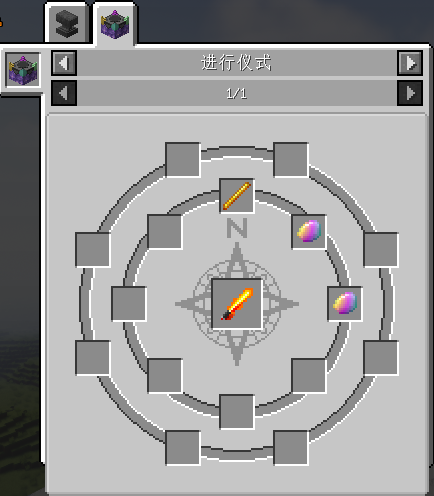

# 绯想之剑

!!! 非官方文档

    本部分为幻想矩阵社制作的非官方介绍文档，可能与实际存在差异

!!! 矩阵社主催的笔记

    比那名居天子的武器。一般而言只有天人才能使用它，但现在，你也可以。或者，你也可以用它整点蟠桃来吃

## 合成

需使用[仪式合成](../功能与特性/仪式合成.md)，具体合成配方请在游戏中使用[JEI物品管理器](https://www.mcmod.cn/class/459.html)查看

下图为本页面编写时的合成配方

<figure markdown>
  {width="600"}
  <figcaption>绯想之剑合成配方，模组版本0.0.8.</figcaption>
</figure>

## 性能与特性

### 性能

绯想之剑攻击力为7点，攻速为2.

### 特性

当你在某个高度（默认为196格，可通过模组菜单更改，更改后需重启游戏）以上使用绯想之剑，将有概率掉落蟠桃。

## 进度

进度名称|获取条件
-----|--------
绯红的感应|获取绯想之剑
蟠桃会|通过破坏高处的树叶获取一些蟠桃

## 其他

!!! 你知道吗

    绯想之剑的剑柄才是本体，剑刃其实是“剑气”（当然，按Q并不能释放剑气）

