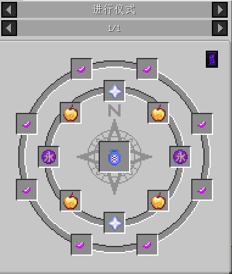

# 蓬莱之药

!!! 非官方文档

    本部分为幻想矩阵社制作的非官方介绍文档，可能与实际存在差异

!!! 矩阵社主催的笔记

    喝下去吧，能怎么样呢？

## 合成

需使用[仪式合成](../功能与特性/仪式合成.md)在末地合成，具体合成配方请在游戏中使用[JEI物品管理器](https://www.mcmod.cn/class/459.html)查看

下图为本页面编写时的合成配方

<figure markdown>
  {width="600"}
  <figcaption>蓬莱之药合成配方，模组版本0.0.8.</figcaption>
</figure>

## 说明

要达到永生不死效果，你需要制作一瓶蓬莱药并将其喝下,过程中你会受到短暂的中毒效果，所以不要尝试用它保命。

## 蓬莱人

喝下蓬莱药后的玩家会成为蓬莱人。蓬莱人免疫缓慢、中毒、挖掘疲劳等负面效果，但瞬间伤害仍然生效。

## 配置文件

配置文件中可配置是否允许制造与使用蓬莱药及复活相关的内容，此项可通过[模组菜单](https://www.mcmod.cn/class/1675.html)在游戏内即时控制

### 蓬莱药失灵

蓬莱药失灵是复活期间的debuff，会导致你的移速变慢，攻击力下降，血条减少。该效果等级随着死亡次数的增加而增加。同时，你也可以设定在效果等级达到某等级时，致命伤害将杀死你

**自版本0.0.9起，蓬莱药失灵效果无法再被牛奶移除**

!!! 你知道吗？

    许多人认为，minecraft中的末地是外太空。这与月之都的设定非常契合。
